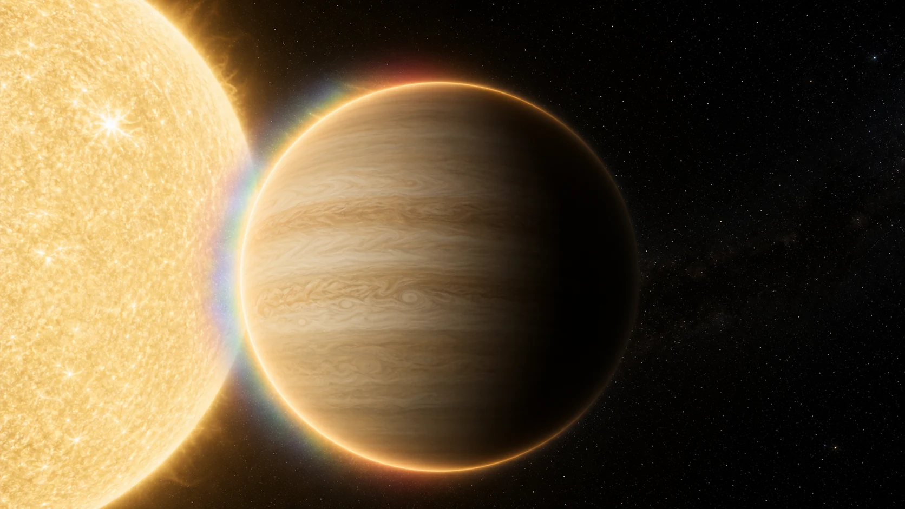
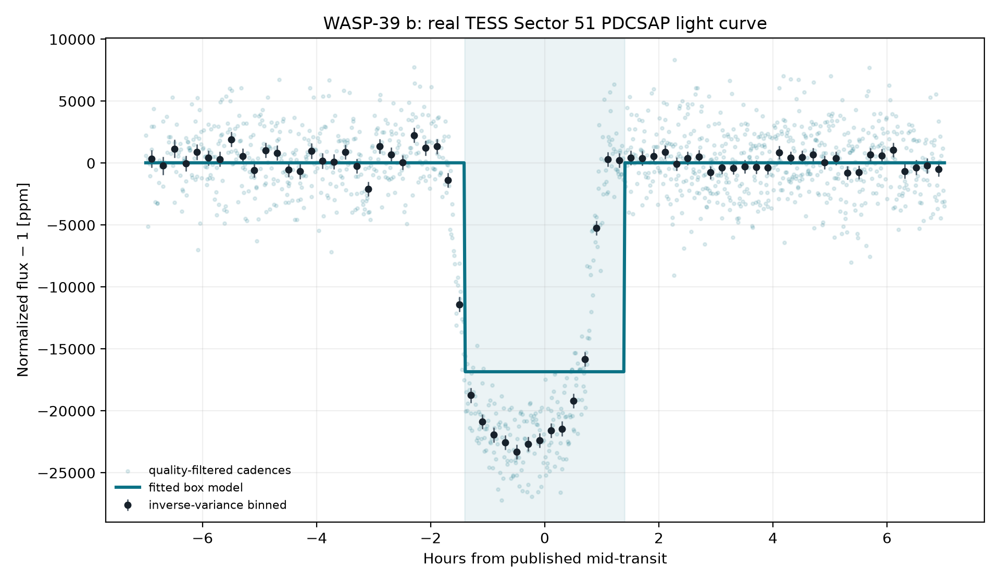
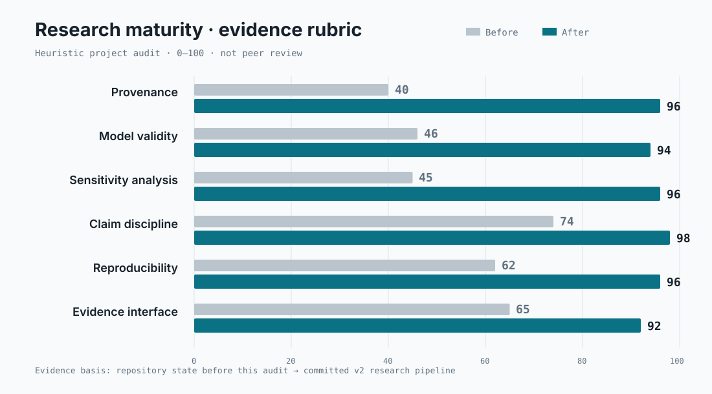
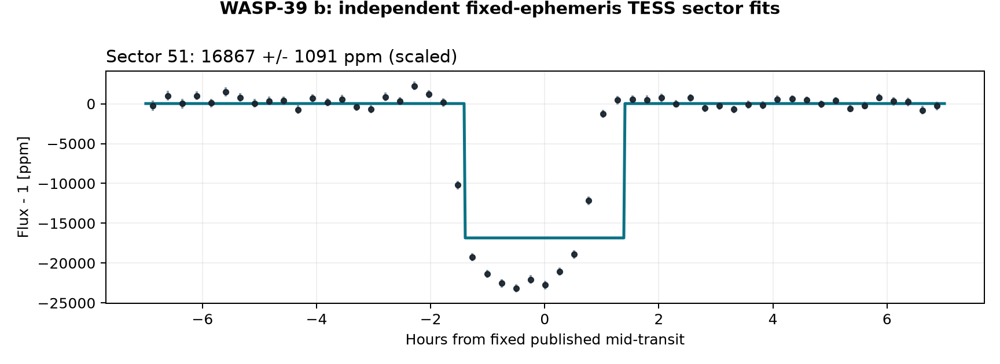
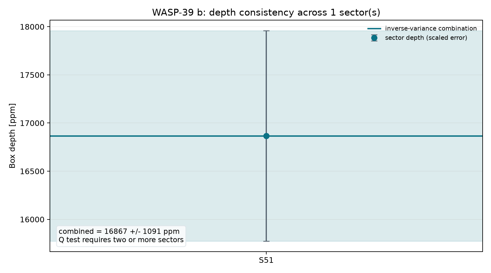
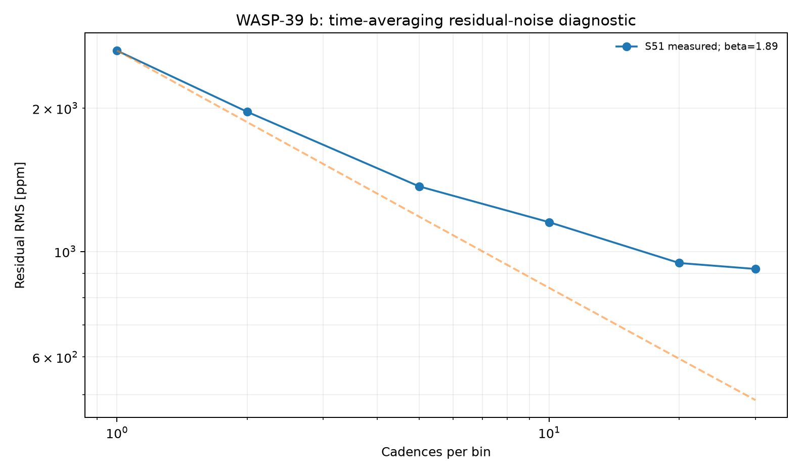
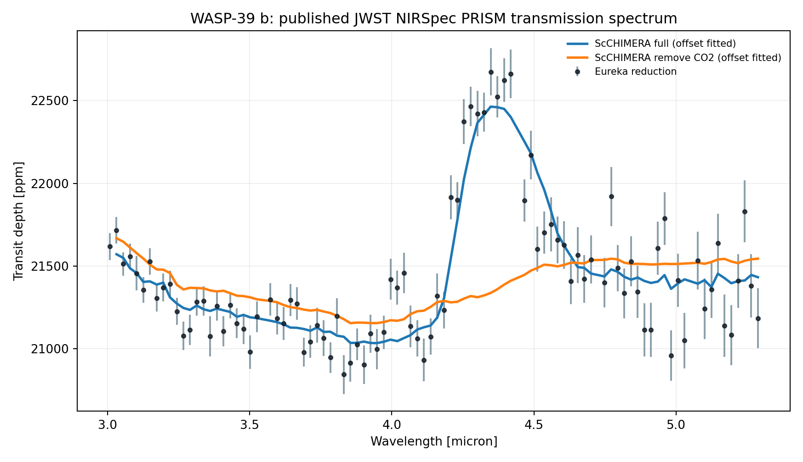
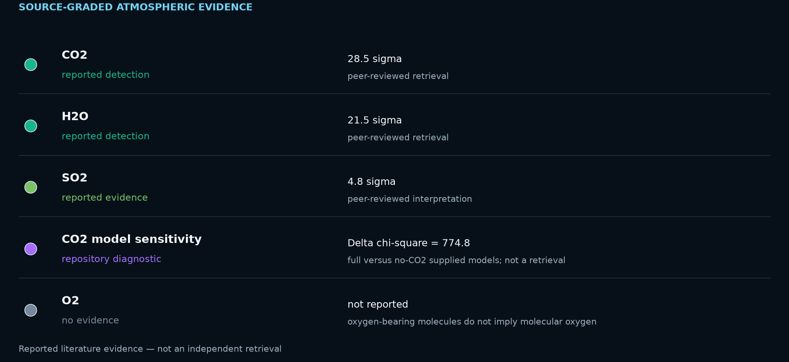
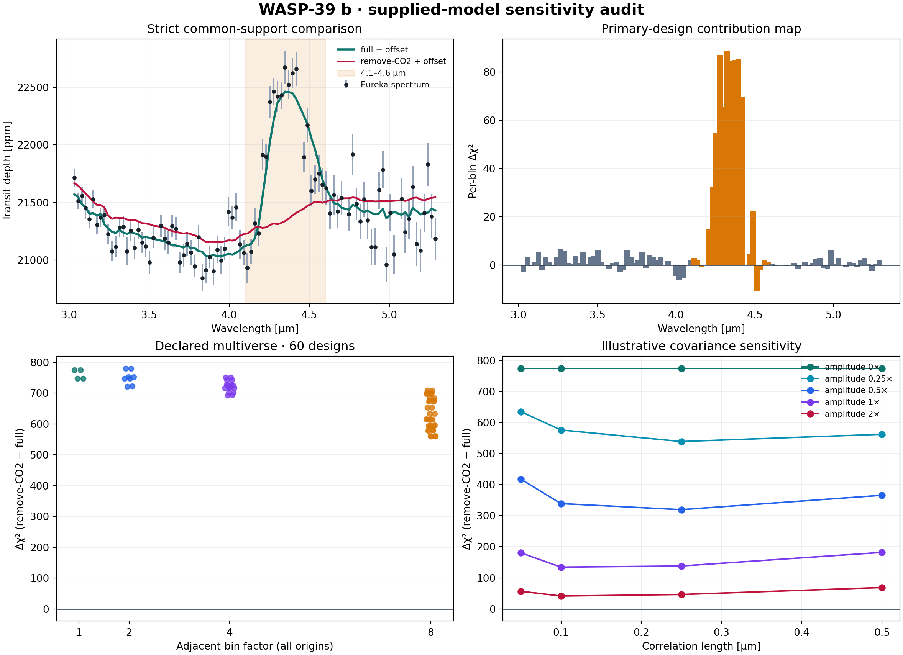

# WASP-39 b: Carbon Dioxide in a Puffy Hot Saturn
<!-- RESEARCH-IDENTITY-START -->
**Independent research report by [Biswajit Jana](https://biswajit1999.github.io/Biswajit_Jana.github.io/)** · [Live report](https://biswajit1999.github.io/wasp-39b-exoplanet-report/) · [ORCID](https://orcid.org/0009-0002-2411-1891) · [Complete research portfolio](https://biswajit1999.github.io/Biswajit_Jana.github.io/research/exoplanets/)
<!-- RESEARCH-IDENTITY-END -->


<!-- TARGET-IDENTITY-START -->
<p align="center">
  
</p>

<p align="center"><em>AI-generated artist's interpretation informed by the measured system properties; not a direct image.</em></p>

**Hot Saturn · transmission spectroscopy · JWST + TESS**

A low-density hot Saturn whose atmosphere became the first clear JWST exoplanet carbon-dioxide benchmark, paired here with a timing-adjusted TESS transit fit and a public NIRSpec spectrum.
<!-- TARGET-IDENTITY-END -->
<p align="center">
  
</p>


**[Open the full report](https://biswajit1999.github.io/wasp-39b-exoplanet-report/)** — the live GitHub Pages version.

<p align="center">
  
</p>

The before/after chart is a transparent repository rubric, not peer review. It
scores source identity, model validity, sensitivity coverage, claim discipline,
reproducibility, and evidence presentation against committed artifacts.

## Data sources

- **System parameters** — the saved `pscomppars` row from the [NASA Exoplanet Archive TAP service](https://exoplanetarchive.ipac.caltech.edu/TAP/sync?query=select+pl_name%2Chostname%2Cra%2Cdec%2Cpl_orbper%2Cpl_tranmid%2Cpl_trandur%2Cpl_rade%2Cpl_bmasse%2Cpl_eqt%2Cpl_orbsmax%2Csy_dist%2Csy_tmag%2Cst_teff%2Cst_rad%2Cst_mass%2Cdisc_year%2Cdiscoverymethod%2Cdisc_refname%2Cdisc_pubdate%2Cdisc_facility+from+pscomppars+where+pl_name%3D%27WASP-39+b%27&format=csv).
- **Observed photometry** — unmodified MAST file `tess2022112184951-s0051-0000000181949561-0223-s_lc.fits`, TESS Sector 51, DOI [10.17909/t9-nmc8-f686](https://doi.org/10.17909/t9-nmc8-f686). This is a real SPOC reduced light curve, not simulated data.
- Exact URLs, IDs, retrieval date, and SHA-256 checksum are in [`data/SOURCE.md`](data/SOURCE.md).

## Reproduce the analysis

```bash
pip install -r requirements.txt
python scripts/analyze_transit.py
python scripts/analyze_multisector.py
python scripts/analyze_spectrum.py
python scripts/analyze_atmospheric_evidence.py
python scripts/analyze_spectral_robustness.py
python scripts/verify_data_provenance.py
pytest tests/ -v
```

The script keeps finite `QUALITY == 0` cadences, normalizes `PDCSAP_FLUX`, and applies one symmetric robust outlier rule. A local linear null is compared with a circular quadratic-limb-darkened transit. The archive period and predicted phase are retained, while midpoint, radius ratio, impact parameter, baseline, and baseline slope are fitted inside a bounded window. The limb-darkening coefficients and scaled semi-major axis are fixed and disclosed in the CSV.

## What the corrected fit shows

| Quantity | Result |
|---|---:|
| TESS sector | 51 |
| Cadences in fitted window | 1572 |
| Transit support | ΔBIC ≥ 10 |
| Midpoint correction | -0.360 h ± 0.40 min |
| Model mid-transit depth | 23024.9 ± 219.7 ppm |
| Radius ratio Rp/Rs | 0.14388 |
| Fitted / published duration | 2.888 / 2.803 h |
| Linear null χ² / dof / BIC | 13993.72 / 1570 / 14008.44 |
| Transit χ² / dof / BIC | 1576.95 / 1567 / 1613.75 |
| ΔBIC (null − transit) | 12394.69 |

The timing-adjusted transit is strongly preferred by ΔBIC = 12394.7. Its fitted midpoint is -0.360 hours from the historical prediction; the model's mid-transit depth is 23024.9 ± 219.7 ppm. A fitted timing correction can diagnose ephemeris drift, but this single-sector fit is not a replacement for a global transit-timing analysis.

<!-- MULTISECTOR-UPGRADE-START -->
## Multi-sector robustness and correlated noise

The archive prediction was timing-adjusted independently in 1 fitted sector(s) (S51), of which 1 meet Delta BIC >= 10. Formal depth errors were inflated by sqrt(max(reduced chi-square, 1)) times the residual time-averaging beta factor (observed range 1.89-1.89). The robust inverse-variance model depth across supported sectors is 23024.9 +/- 414.4 ppm; a sector-to-sector Q test requires at least two supported sectors. These scaled errors address underestimated scatter and short-timescale correlation, but they are not a full Gaussian-process or physical limb-darkened transit fit.

<p align="center"></p>

<p align="center"></p>

<p align="center"></p>

The per-sector table is in [`figures/multisector_statistics.csv`](figures/multisector_statistics.csv). Regenerate all three figures with `python scripts/analyze_multisector.py`.
<!-- MULTISECTOR-UPGRADE-END -->

<!-- SPECTRUM-UPGRADE-START -->
## Published planetary spectrum

<p align="center"></p>

Across all 94 bins, a weighted-flat spectrum gives chi-square/dof = 1089.6/93
(p = 1.06e-169). The fixed full and remove-CO2 curves are compared only on
the 93 observed bins entirely inside their shared support, after fitting one
vertical offset to each. This diagnostic establishes spectral structure; by
itself it is not a molecule-detection or retrieval calculation.

Source: [10.5281/zenodo.6959427](https://zenodo.org/records/6959427) (JWST NIRSpec PRISM). Exact files and checksums are in [`data/SOURCE.md`](data/SOURCE.md); complete numerical results are in [`figures/spectrum_statistics.csv`](figures/spectrum_statistics.csv).
<!-- SPECTRUM-UPGRADE-END -->

<!-- ATMOSPHERE-EVIDENCE-START -->
## Atmospheric evidence: detection, limit, or unknown?

<p align="center"></p>

The repository's direct calculation shows strong spectral structure and a large preference for the supplied full ScCHIMERA model over its no-CO2 counterpart after one fitted vertical offset. Detection significances below come from the cited peer-reviewed NIRSpec/G395H retrieval, not from converting that diagnostic Δχ² into sigma.

| Species | Status | Evidence | Basis |
|---|---|---|---|
| CO2 | reported detection | 28.5 sigma | peer-reviewed retrieval |
| H2O | reported detection | 21.5 sigma | peer-reviewed retrieval |
| SO2 | reported evidence | 4.8 sigma | peer-reviewed interpretation |
| CO2 model sensitivity | repository diagnostic | Delta chi-square = 774.8 | full versus no-CO2 supplied models; not a retrieval |
| O2 | no evidence | not reported | oxygen-bearing molecules do not imply molecular oxygen |

Primary source: [Alderson et al. 2023, Nature](https://doi.org/10.1038/s41586-022-05591-3). The table is also available as [`data/atmospheric_evidence.csv`](data/atmospheric_evidence.csv). Oxygen-bearing species such as H2O, CO2, and SO2 are **not** evidence for molecular oxygen (O2) or a biosignature.
<!-- ATMOSPHERE-EVIDENCE-END -->

## Is the supplied CO2-sensitive comparison robust?

<p align="center"></p>

The report compares the public spectrum with the supplied full and remove-CO2
ScCHIMERA curves after fitting one vertical offset to each. The primary audit
uses 93 bins whose full widths lie inside both model files' shared wavelength
support. It excludes the first archive bin rather than silently extrapolating
the remove-CO2 curve beyond its 3.01386-micron lower boundary.

| Predeclared diagnostic | Result |
|---|---:|
| Primary common-support contrast | Delta chi-square = 774.4 |
| 60-design multiverse | 559.6 to 780.4; 60/60 positive |
| Delete the most influential single bin | minimum 684.8 |
| 20-cell illustrative covariance grid | minimum 41.5 |
| Delete every tested contiguous 0.10/0.25/0.50-micron block | minimum 3.19 |
| Fit only 4.1–4.6 microns | 289.4 |
| Fit everything outside 4.1–4.6 microns | 6.04 |

The multiverse crosses center sampling versus exact piecewise-linear bin
integration, mean versus maximum asymmetric errors, and factors 1/2/4/8 at
every possible bin origin. The sign survives all 60 designs and every
single-bin deletion. The contiguous-block result adds the crucial qualifier:
removing a half-micron region around the 4.3-micron feature nearly removes the
contrast. The preference is stable to preprocessing choices but localized,
not broadband.

These numbers are **not detection significances**. The two supplied forward models are not a complete nested retrieval, the covariance models are illustrative rather than inferred from detector-level residuals, and the atmospheric parameters were not marginalized. Peer-reviewed retrievals remain the source for molecular significance and abundance.

For physical scale, the saved mass, radius, equilibrium temperature, and stellar radius imply surface gravity **4.26 m s-2** and an illustrative H2/He scale height of **983 km** for mean molecular weight 2.3. One scale height changes the transit depth by approximately **421 ppm**; the spectrum's robust 5th-to-95th-percentile range is **1,487 ppm**, or **3.53 scale heights** under that assumption. This describes observability, not composition by itself.

Download the machine-readable
[`summary`](figures/spectral_robustness_statistics.csv),
[`60-design multiverse`](figures/spectral_multiverse.csv),
[`covariance grid`](figures/spectral_covariance_grid.csv),
[`contiguous-block deletions`](figures/spectral_block_deletions.csv), or
[`per-bin contributions`](figures/spectral_bin_contributions.csv). Exact archive
paths, byte hashes, and normalized-content hashes are documented in
[`data/SOURCE.md`](data/SOURCE.md) and checked offline by
`scripts/verify_data_provenance.py`.

## System context

- Radius: 14.34 Earth radii
- Mass: 89.31 Earth masses
- Orbital period: 4.055294 days
- Transit duration: 2.803 hours
- Semi-major axis: 0.0483 AU
- Equilibrium temperature: 1166 K
- Host: WASP-39 · distance 213.98 pc
- Discovery: 2011 by Transit (SuperWASP)

## Limitations

- The orbit is assumed circular and the quadratic limb-darkening coefficients are fixed representative values; they are not atmosphere-grid interpolations.
- The scaled semi-major axis is derived from the saved composite semi-major axis and stellar radius; their uncertainties are not propagated.
- Midpoint freedom corrects accumulated ephemeris error but introduces a bounded timing search. ΔBIC, not a naïve one-parameter p-value, is used as the support gate.
- PDCSAP processing, dilution, stellar variability, transit-timing variations, and long-timescale covariance can still bias the inferred geometry.
- Radius ratio, impact parameter, and fixed limb darkening are correlated. Published global fits with physical priors and simultaneous detrending remain authoritative.
- The full/no-CO2 comparison uses two archived forward models with one fitted offset. It does not marginalize temperature, metallicity, clouds, chemistry, instrument systematics, or limb asymmetry.
- The remove-CO2 curve is an archive-provided “remove one gas at a time” spectrum. The repository does not refit that model or reproduce the source retrieval.
- The first observed spectral bin is excluded from model comparisons because its lower edge lies outside the remove-CO2 model support; no model extrapolation is permitted.
- The correlated-noise kernels are explicit sensitivity experiments, not covariance matrices estimated from the original time-series reduction.
- The scale-height conversion assumes equilibrium temperature and mean molecular weight 2.3; both are model-dependent terminator approximations.

## Repository structure

```text
README.md
index.html
requirements.txt
data/                       unmodified TESS FITS + NASA row + SOURCE.md
scripts/analyze_transit.py  timing-adjusted limb-darkened transit fit
scripts/analyze_spectral_robustness.py  binning, jackknife, covariance + scale-height tests
scripts/verify_data_provenance.py       offline local/archive checksum verification
figures/                    generated plot + summary_statistics.csv
tests/                      real-data regression tests
.github/workflows/tests.yml CI on every push and pull request
LICENSE                     MIT
```

## References

1. [Faedi et al. 2011](https://ui.adsabs.harvard.edu/abs/2011arXiv1102.1375F/abstract) — discovery reference as listed by the NASA Exoplanet Archive.
2. Ricker, G. R. et al. (2015), *Transiting Exoplanet Survey Satellite (TESS)*, JATIS 1, 014003, [doi:10.1117/1.JATIS.1.1.014003](https://doi.org/10.1117/1.JATIS.1.1.014003).
3. TESS Team, *TESS Light Curves — All Sectors*, MAST, [doi:10.17909/t9-nmc8-f686](https://doi.org/10.17909/t9-nmc8-f686); Sector 51 used here.
4. [NASA Exoplanet Archive](https://exoplanetarchive.ipac.caltech.edu/), `pscomppars` TAP row retrieved 2026-08-15.
5. JWST Transiting Exoplanet Community Early Release Science Team (2023), *Identification of carbon dioxide in an exoplanet atmosphere*, [doi:10.1038/s41586-022-05269-w](https://doi.org/10.1038/s41586-022-05269-w).
6. Alderson, L. et al. (2023), *Early Release Science of the exoplanet WASP-39b with JWST NIRSpec G395H*, [doi:10.1038/s41586-022-05591-3](https://doi.org/10.1038/s41586-022-05591-3).

## Author

Biswajit Jana — [Portfolio](https://biswajit1999.github.io/Biswajit_Jana.github.io/) · [GitHub](https://github.com/Biswajit1999) · [LinkedIn](https://www.linkedin.com/in/biswajit-jana-27011a151/) · [ORCID](https://orcid.org/0009-0002-2411-1891)
